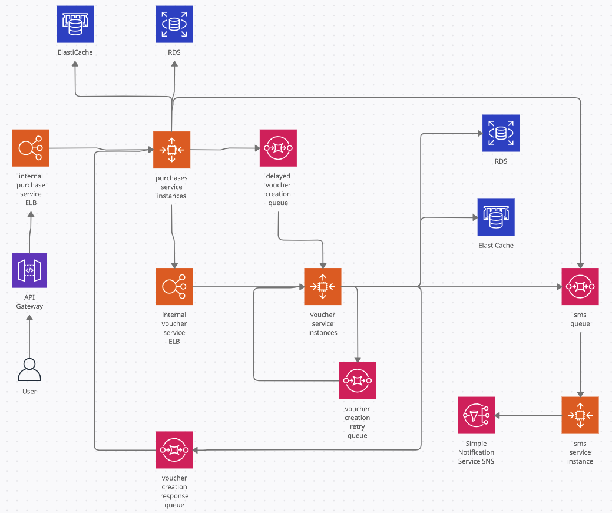
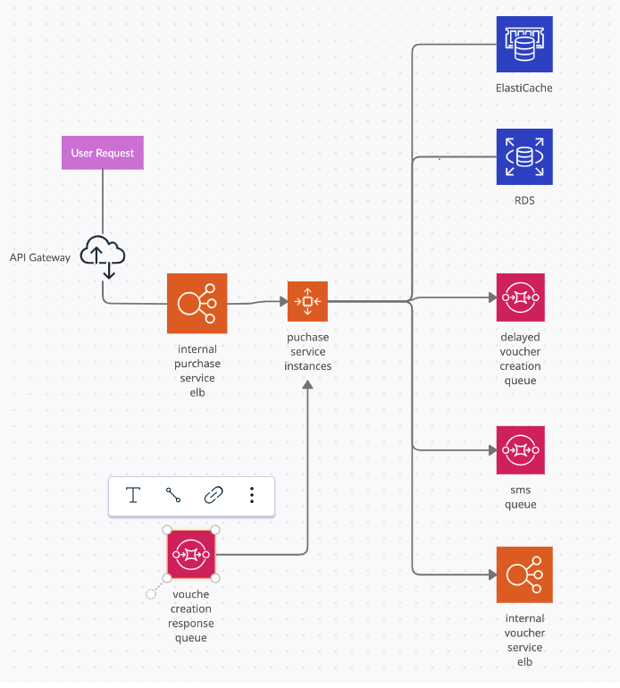
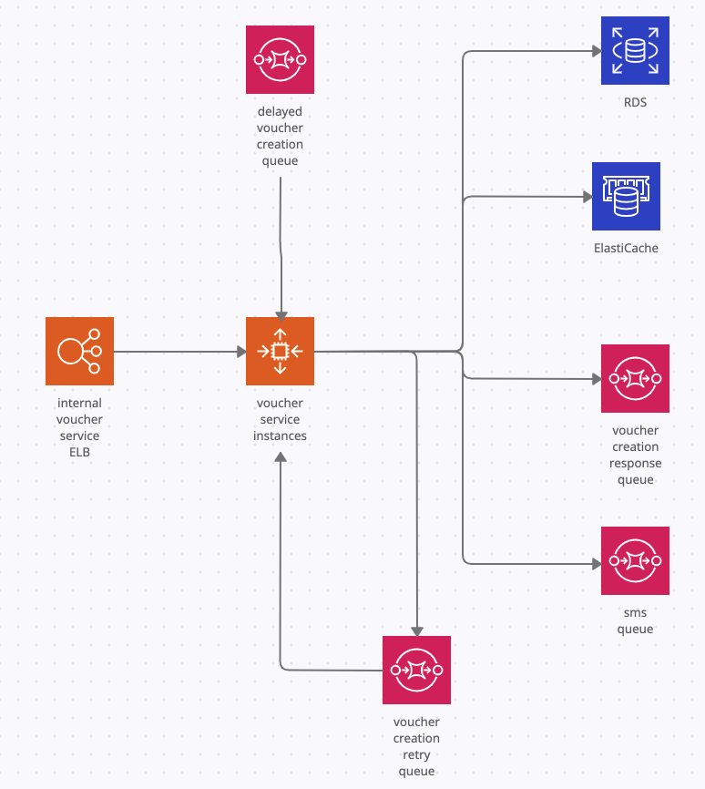
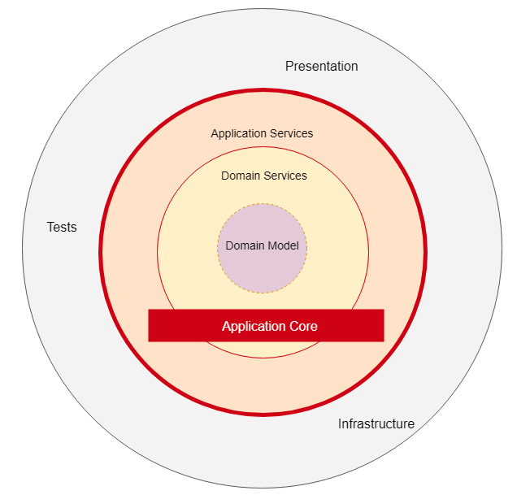
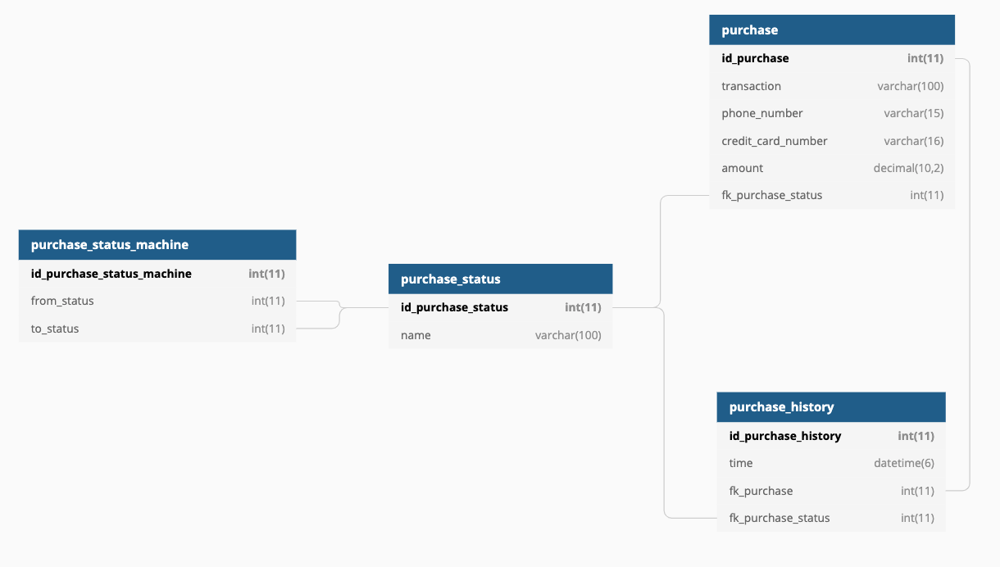
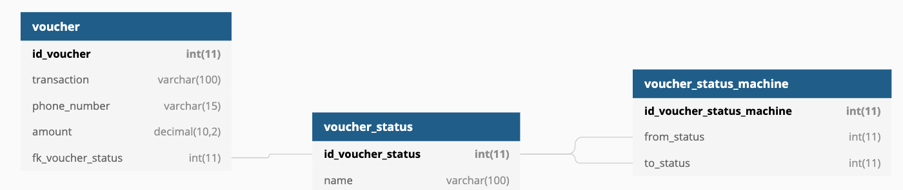
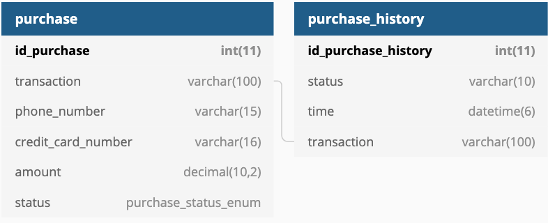
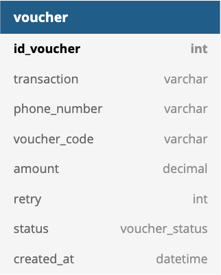

# Scenario

This service allow users to buy voucher code using their credit card. To process, user need to input credit card information, voucher code value and phone number for contact. After that, he/she will be redirect to website of payment partner and have to enter and OTP password sent by the partner. After that, user will be redirect to our website again for getting voucher code. There will be 2 cases, if our service work smoothly, user will see voucher code immediately, if any error happen, the voucher code will be sent to the phone number which user enter earlier.

# System design
## Overview
Our service includes 3 microservices:
* purchase service: this service process and keep payment info
* voucher service: this service manage and is responsible for getting voucher code from 3rd party partner
* sms service: send and keep sms history

Communication to these services from outside need to go through an api gateway, 
 


## Purchase service

Purchase service is deployed in a ECS cluster for easy management and scaling, requests going to purchase service through an aws ELB to load balance between EC2 instances. It will use RDS mysql for database and elastic redis for cache
  
 

After user is redirected by payment partner, purchase service receive payment success request and start getting voucher code. It firstly make synchronous http request to voucher service.
* If voucher service response with a voucher code, the voucher code will be shown to user immediately.
* If voucher service response that it's processing, purchase service will show message saying that the request will be process in 30s
* If voucher service response that it's failed, purchase service will show message saying user should reach out to administrator
* If there's no response or error happen while processing request, purchase service will send asynchronous request to voucher service via delay_voucher_creation queue and receive response via voucher_creation_response queue

## Voucher service 
Similar to purchase service, voucher service is deployed in a ECS cluster for easy management and scaling, requests going to purchase service through an aws ELB to load balance between EC2 instances. It will use RDS mysql for database and elastic redis for cache

 

When Voucher service receive request from purchase service, it will try to make request to 3rd party service to get voucher code immediately
* if 3rd party response with a voucher code, voucher service will send it to purchase service accordingly (via http response or voucher_creation_response queue)
* if error happen, voucher service will send try request to voucher_creation_retry queue and keep retrying. After a number of time, it the request still not success, it will send failure response to purchase service via voucher_creation_response queue, else send success response.
  * in case voucher creation success, voucher service will send request to sms service via sms queue to send sms to user
  
## Sms service
A simple service which use SNS service to send notification, in this demo it only print message to terminal

# Project structure

All services use spring boot with hibernate, utilize IoC/DI feature by default for injecting concrete classes to where it needed
Each service follow Onion architect and divided into 4 layers for each module (or boundedcontext) with dependency move inwards. The layers inside the application core define the interfaces that the outer layers can use. (except sms service, it's kind of a mock service)
Domain layer will hold business login while application layer will coordinate task need to be perform and outer layers are responsible for communication, request/response to external parties                                                                             
 
    
SOLID principle is also well respected, controller/service/repo class has its single responsibility and only hold interfaces references to other classes, concrete class will be inject via constructor or provided by spring container, any concrete class can be injected and use without any problem.

General project structure is like this:

    
```
.
├── main
│   └── java
│       └── com.example.servicename
│           ├── config
│           ├── boundedcontext
│           │   ├── shared                  #common modules used by other modules like message queue, cache, log 
│           │   ├── serviceX
│           │   │   ├── application         # application layer class, coordinate actions/tasks/components needed to perform a business request/action
│           │   │   ├── domain              # domain layer class, layer that contain real business rules, logics 
│           │   │   ├── exception           # exceptions
│           │   │   └── infrastructure      # infrastructure layer class, make real connection/interaction with external services, database, internet communication
│           │   └── serviceY
│           │       ├── application
│           │       └── ...
│           ├── controller                  # controller class, for request routing
│           ├── util                        # utility classs
│           └── Application.java            # static main class, entry point for application
├── test
│   └── com.example.servicename
│           └── ...                         # similar structure as main folder, contain tests
└── ...
```
## Database design
Ideally purchase and voucher schema should be designed like this

 

 

However, because of time limit and demo simplicity, schema for the 2 services are done like this 
 

 

## Framework and library
Framework and library used include:
* spring boot
* hibernate 
* spring cloud
* gson
* flyway - database migration management
* jedis - cache
* mockito - test
* mysql connector


## Install and running
* clone from https://github.com/phanthehung/java
* install docker, make sure you can mount volume in the clone directory
* open terminal and move to java directory (the clone directory)
* use the following command
    * `make build`, wait for around 10 - 20 minute, have a coffee
    * `make run`, wait a few minute, this command may fail on first run because of database initialization
    * open another terminal tab, type `docker ps` and verify that there are 6 containers running
    * if there're less than 6 containers, use `make stop` and go back to previous terminal tab and use `make run` again
* if you cannot use `make` command, use the following commands:
    * `docker network create -d bridge nab_hungphan || true`
    * `docker-compose build` => similar to `make build` command
    * `docker-compose up` => similar to `make run` command
    * open another terminal tab, type `docker ps` and verify that there are 6 containers running
    * if there're less than 6 containers, use `docker-compose down` and go back to previous terminal tab and use `docker-compose up` again
    
    
## Demo

* step 1: send request to make a purchase:
```
curl --location --request POST 'http://localhost:8088/voucher/credit' \
--header 'Content-Type: application/json' \
--data-raw '{
  "phone_number": "0903876678",
  "credit_number": "8762567887917263",
  "expire_date" : "2021-03-16T22:29:04",
  "secret_number" : "423",
  "amount" : 30000
}'
```
example response:
```$x
{
    "url": "%7B%22transaction%22+%3A+%22FgMys3LcydKZMV96xb6SneynNcZ0i8%22%2C%22phone_number%22%3A+%221233%22%2C%22success%22%3A+true%2C%22amount%22+%3A+30000.0%7D",
    "transaction": "FgMys3LcydKZMV96xb6SneynNcZ0i8"
}
```
this api simulate the request to make purchase on website, response contain transaction of the purchase for tracking, the url with encrypted payload which our website use to redirect user to payment partner website, for demo purpose, the url is exactly the payload use for second step

* step 2: this step assume user have entered credit card and OTP correctly and redirected to our website, so send request to our server
    * request:
    ```
    curl --location -g --request GET 'http://localhost:8088/callback/purchase/credit?provider=dsa&payload={{payload}}'
    ```
    replace {{payload}} with previous response `url` field, for example
    ```
    curl --location -g --request GET 'http://localhost:8088/callback/purchase/credit?provider=dsa&payload=%7B%22transaction%22+%3A+%22FgMys3LcydKZMV96xb6SneynNcZ0i8%22%2C%22phone_number%22%3A+%221233%22%2C%22success%22%3A+true%2C%22amount%22+%3A+30000.0%7D'
    ```
    * the response will be: 
        * a voucher code if no error happen
        * a message saying that request will be process in 30s, this simulate timeout error when calling 3rd party api, you will see voucher code printed in your running terminal like this 
            ``` 
            phone number: 0903876678 | transaction: FgMys3LcydKZMV96xb6SneynNcZ0i8 | phone number: 0903876678 | amount: 30000.0
            ```
    you can do the same again and create as many voucher code as you want
* step 3: to see all voucher code that you purchased, firstly you need to make a request to get a token and use that token to get all purchase, the token will be sent to you phone number, in this case it's printed to terminal again
    * request 
        ```
        curl --location --request GET 'http://localhost:8088/voucher/token?phone_number=0903876678'
        ``` 
    * message receive in terminal:
        ```
        phone number: 0903876678 | token: VV9RoS
        ```  
* step 4: send request with token to all purchased
    * request 
        ```
        curl --location --request GET 'http://localhost:8089/voucher/list?phone_number=0903876678&token=VV9RoS'
        ``` 
    * message receive in terminal:
        ```
        [{"voucher_code":"FgMys3LcydKZMV96xb6SneynNcZ0i8","transaction":"YKIM8CcN3XbF8Oohbe9n","status":"success","amount":30000.0}]
        ```  